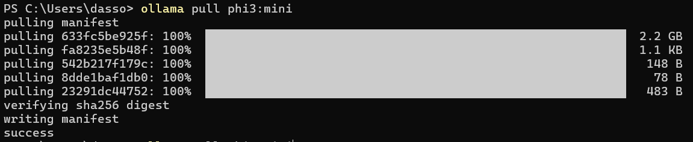

# In this project we are using Ollama to extent more offline functionalities.

# Steps to Install Ollama 
1. Download Ollama from `https://ollama.com/download`
2. Install the Ollama application in your device 
3. Open your terminal and check for `ollama list` 
4. I am using `ollama phi3:mini` here since we are building an offline RAG with not that much load. write `ollama pull phi3:mini` in the terminal and let the model get downloaded.
5. I am using  `winget install --id Gyan.FFmpeg` to download `FFmpeg` for faster audio conversion.

# Steps to run this script for video RAG
1. Install the dependencies `pip install -r requirements.txt`
2. Run the `src/transcribe_whisper.py` file where we are using Whisper API by OpenAi to get the transcripts of the video.
3. Run the `src/build_vectorstore.py` file to convert the transcript to vector DB
4. Run the `src/query_ollama.py` to ask questions from the video and also get the timestamp.